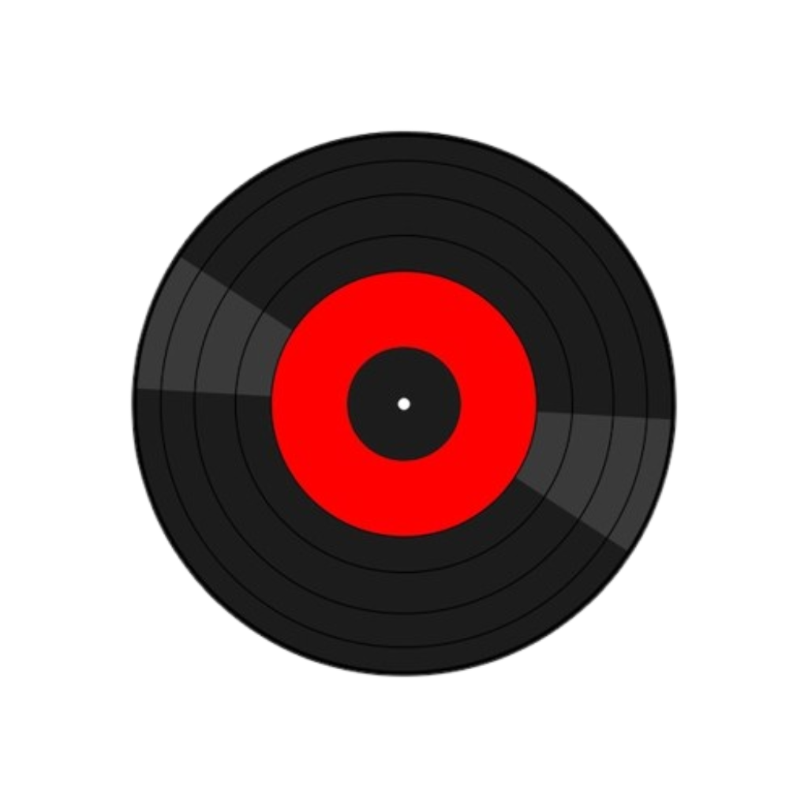

# Riff

  

  A fast, minimal, and extensible music player.

---

## Overview

Riff is a lightweight music player built to deliver a smooth and reliable listening experience. It emphasizes clarity, performance, and simplicity, while maintaining a strong architectural foundation for long-term evolution.

The application is designed to handle core music workflows efficiently without introducing unnecessary complexity.

---

## Features

* Audio playback with a responsive interface
* Music library browsing
* Basic metadata support (title, artist, album)
* Playlist creation and management
* Clean and minimal UI

---

## Principles

Riff is built around a focused set of principles:

* **Clarity** — Interfaces should be intuitive and predictable
* **Performance** — Every interaction should feel fast and efficient
* **Reliability** — Core functionality must remain stable under all conditions
* **Scalability** — The system should support future expansion without rework

---

## Tech Stack

* Frontend: React
* Backend: Go
* Desktop Runtime: Tauri

---

## Architecture

Riff follows a modular architecture separating the user interface from system-level operations.
The frontend handles rendering and interaction, while the backend manages filesystem access and audio control through a lightweight runtime.

This separation ensures maintainability and allows independent evolution of each layer.

---

## Security & Privacy

Riff operates entirely on local files.
No user data is collected, transmitted, or stored externally.

---

## Contributing

Contributions are currently limited as the project is under active development.
For discussions or suggestions, feel free to open an issue.

---

## License

This project is licensed under the MIT License.
